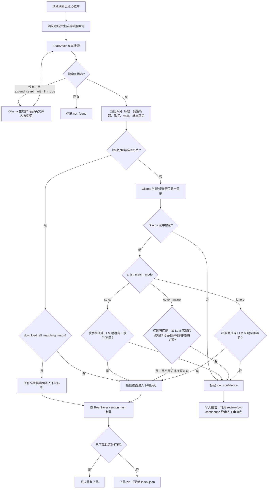

# BeatSaver Sync

根据你的网易云“我喜欢的音乐”列表，自动搜索并下载最匹配的 BeatSaver 谱面。

## 安装

使用 `uv` 安装依赖：

```powershell
uv sync
```

如果要使用默认的本地大模型辅助匹配，先拉取一次模型：

```powershell
ollama pull qwen3.6:27b
```

默认不启用备用模型，避免显卡在两个模型之间切换。如果你想用更轻的模型，可以在 `config.json` 里把 `ollama_model` 改成已经拉取的模型，例如 `granite4.1:8b`。

## 网易云 Cookie

红心歌单通常需要登录态 cookie 才能完整读取。

1. 在浏览器登录 `https://music.163.com`。
2. 打开浏览器开发者工具，查看任意 `music.163.com` 的网络请求。
3. 复制请求头里的完整 `Cookie`。
4. 保存到 `.secrets/netease.cookie`。

`.secrets/` 已被 git 忽略。cookie 只会发送给网易云，不会写入报告或日志。

## 运行

默认参数都在 `config.json` 里，日常直接运行：

```powershell
uv run beatsaver-sync
```

如果要使用其他配置文件：

```powershell
uv run beatsaver-sync --config config.json
```

`config.json` 示例：

```json
{
  "netease_liked": true,
  "cookie_file": ".secrets/netease.cookie",
  "output": "output",
  "search_with_artists": false,
  "expand_search_with_llm": true,
  "download_all_matching_maps": true,
  "artist_match_mode": "cover_aware",
  "search_concurrency": 5,
  "search_retries": 3,
  "download_concurrency": 3,
  "ollama_concurrency": 1,
  "ollama_model": "qwen3.6:27b",
  "ollama_fallback_model": null,
  "min_confidence": 0.72,
  "console_logging": false,
  "force_refresh_search": false,
  "redownload": false,
  "limit": null
}
```

命令行参数仍然可以临时覆盖配置：

```powershell
uv run beatsaver-sync `
  --output output `
  --search-concurrency 5 `
  --download-concurrency 3 `
  --ollama-concurrency 1 `
  --ollama-model qwen3.6:27b `
  --ollama-fallback-model qwen3.5:35b `
  --min-confidence 0.72
```

如果想先小范围试跑：

```powershell
uv run beatsaver-sync --limit 10
```

## 配置参数

`netease_liked`

是否读取网易云“我喜欢的音乐”歌单。当前版本只支持这个来源，所以保持 `true` 即可。

`cookie_file`

网易云登录态 cookie 文件路径。默认是 `.secrets/netease.cookie`。如果你把 cookie 放在别的位置，就改成对应路径。不要把 cookie 直接写进 `config.json`。

`output`

输出目录。默认是 `output`，下载的 zip、缓存、日志和报告都会放在这里。如果你想把结果放到其他盘或单独目录，可以改成绝对路径或相对路径。

`search_with_artists`

搜索 BeatSaver 时是否把歌手名拼进关键词。默认 `false`，只用歌名和拆分后的标题片段搜索，例如 `白夜洇润 Unfurling Night` 会生成 `白夜洇润 unfurling night`、`白夜洇润`、`unfurling night` 等关键词。一般不建议打开，因为 BeatSaver 标题里经常没有网易云歌手名；是否歌手匹配会在候选评分和 LLM 判断阶段处理。

`expand_search_with_llm`

普通关键词搜不到结果时，是否让 Ollama 生成罗马音、英文译名等搜索词再搜一轮。默认 `true`。例如日文 `恋愛裁判` 可能扩展出 `Love Trial` 或 `Renai Saiban`，中文/日文标题也可能扩展出英文翻译。这个步骤只在普通搜索没有结果、且标题包含非 ASCII 字符时触发，用来提高召回，不会替代后续匹配判断。

`artist_match_mode`

歌手匹配策略。默认 `cover_aware`，适合你的歌单里有大量翻唱、原曲、罗马音和译名混在一起的情况。

- `strict`：最保守。自动接受 LLM 候选时，BeatSaver 歌手必须和网易云歌手相似，或 LLM 明确说明歌手是同一人/别名。
- `cover_aware`：推荐。标题强匹配或 LLM 高置信说明是罗马音、翻译、翻唱、原曲关系时，允许 BeatSaver 歌手和网易云歌手不一致；但 `Q`、`Baby`、`Stay` 这类短标题/泛标题仍需要歌手证据。
- `ignore`：最宽松。自动接受 LLM 候选时基本不看歌手，只看标题和 LLM 判断。适合你想多下载，之后人工筛。

`download_all_matching_maps`

是否下载同一首歌下所有高置信 BeatSaver 谱面。默认 `true`。如果一首歌搜出了多个不同 mapper 做的谱面，并且规则评分都高于 `min_confidence`，会把这些谱面都加入下载队列；下载仍然按 BeatSaver version hash 去重。改成 `false` 时恢复旧行为，只下载排序最高的一个谱面。

`search_concurrency`

BeatSaver 搜索和匹配阶段的并发数。默认 `5` 比较温和。调大可以更快，但也更容易遇到网络波动或接口限流；如果搜索经常失败，可以调低到 `2` 或 `3`。

`search_retries`

BeatSaver 搜索请求失败时的重试次数。默认 `3`。如果日志里经常看到 `ConnectError` 或临时网络错误，可以保持或调高；如果你想失败得更快，可以调低。

`download_concurrency`

同时下载 zip 的数量。默认 `3`。网速很快时可以调到 `5`，但太高会让进度条更乱，也可能触发下载失败。

`ollama_concurrency`

同时调用 Ollama 做疑难判断的数量。默认 `1`。本地大模型比较吃显存，4090 上也建议先保持 `1`；如果确认模型运行很稳，再考虑调到 `2`。

`ollama_model`

疑难匹配时优先使用的 Ollama 模型。默认 `qwen3.6:27b`，适合中英日混合歌名、翻译名和歌手别名判断。第一次使用前需要执行 `ollama pull qwen3.6:27b`。

`ollama_fallback_model`

主模型不可用时使用的备用模型。默认 `null`，表示不启用备用模型，避免显卡在两个大模型之间切换。只有你明确想用备用模型时才改成模型名。注意：如果主模型已经返回内容但格式不对，工具不会再调用备用模型，而是把该次 LLM 判断视为失败并回退到规则结果。

`min_confidence`

自动下载的最低置信度阈值，范围是 `0.0` 到 `1.0`，默认 `0.72`。调高会减少误下载，但跳过更多歌曲；调低会下载更多候选，但错配风险更高。

`console_logging`

是否把运行日志也显示在终端。默认 `false`，终端只显示进度条和最终报告路径，详细日志仍然写入 `output/logs/beatsaver-sync.log`。如果你想边跑边看 HTTP 请求、搜索关键词、Ollama 警告等细节，可以改成 `true` 或临时加 `--console-log`。

`force_refresh_search`

是否忽略 BeatSaver 搜索缓存并重新请求接口。默认 `false`。如果你觉得缓存结果过旧，或调整了搜索逻辑后想重新搜索，可以改成 `true` 或临时加 `--force-refresh-search`。

`redownload`

是否无视已下载索引，强制重新下载。默认 `false`。平时不要打开；只有当 zip 损坏、想重新拉一遍文件时再改成 `true` 或临时加 `--redownload`。

`limit`

限制本次最多处理多少首歌。默认 `null`，表示处理完整红心歌单。调试时建议设成 `10` 或使用 `--limit 10`，确认 cookie、搜索、匹配和下载都正常后再跑全量。

## 匹配流程



## 音频源接口

项目里已经预留了音频源抽象，后续音频相似度比较不会绑死网易云：

- `SourceSong`：统一歌曲模型，包含来源、来源 ID、标题、歌手、专辑、时长，以及可选本地音频路径或 URL。
- `AudioReference`：统一音频引用，可以是 `url`、`file` 或 `bytes`。
- `AudioSource`：音频源接口，负责把任意来源的歌曲转换成可比较的音频引用。
- `NeteaseAudioSource`：使用当前网易云 cookie 调 `api/song/enhance/player/url` 获取歌曲播放 URL。
- `LocalFileAudioSource`：面向后续 foobar2000 或本地曲库，直接返回本地文件路径。

后面做 10 秒 BeatSaver `previewURL` 相似度时，会只依赖 `AudioSource`，所以可以把网易云、foobar2000、本地文件放在同一套比较流程里。

## 输出

- `output/downloads/*.zip`：下载好的 BeatSaver 谱面 zip。
- `output/downloads/index.json`：已下载版本 hash 索引，用来跳过重复谱面。
- `output/cache/beatsaver_searches.json`：BeatSaver 搜索缓存。
- `output/cache/matches.json`：网易云歌曲到匹配结果的缓存，用来跳过已经匹配过的歌曲和减少 LLM 调用。
- `output/logs/beatsaver-sync.log`：运行日志。
- `output/reports/report.md`：方便人工查看的报告。
- `output/reports/report.json`：结构化报告。

BeatSaver 搜索缓存按搜索关键词复用，所以同名歌、翻唱、不同歌手版本可以共享搜索结果。匹配缓存按网易云歌曲 ID、歌名、歌手和关键匹配配置区分，不会把翻唱直接当成同一个匹配结果复用。下载按 BeatSaver 版本 hash 去重。只有索引记录存在，并且对应 zip 文件仍然存在时，才会认为该谱面已经下载过。

## 下载低置信假阴

如果报告里有低置信但你确认是正确的候选，先导出审核表：

```powershell
uv run beatsaver-sync review-low-confidence --min-confidence 0.0
```

这会生成 `output/reports/low-confidence-review.tsv`。用表格软件打开，把确认要下载的行第一列 `download` 从 `0` 改成 `1`，保存后运行：

```powershell
uv run beatsaver-sync download-review
```

下载仍然会复用 `output/downloads/index.json` 判重；已经下载过的 hash 会跳过。`review-low-confidence` 默认也会把 “Ollama 认为对，但本地歌手/标题门槛挡掉” 的候选放进表里，方便你手动放行。

## 生成 bplist

下载完成后可以从 `output/downloads/index.json` 生成 Beat Saber 播放列表：

```powershell
uv run beatsaver-sync generate-playlist
```

默认输出到 `output/playlists/beatsaver-sync.bplist`，只包含索引里记录且 zip 文件仍然存在的谱面。可以自定义标题和作者：

```powershell
uv run beatsaver-sync generate-playlist `
  --title "NetEase Liked BeatSaver" `
  --author "haoran"
```
